## Contents

| Guide | Sections |
| --- | --- |
| **[Provision AWS Lightsail Instance](#provision-aws-lightsail-instance)**<br>Provision the AWS Lightsail instance used to host the LLM Gateway. | [Step 1 — Open AWS Console](#step-1--open-aws-console) · [Step 2 — Search for Lightsail](#step-2--search-for-lightsail) · [Step 3 — Create Instance](#step-3--create-instance) · [Step 4 — Choose Instance Image](#step-4--choose-instance-image) · [Step 5 — Choose Instance Plan](#step-5--choose-instance-plan) · [Step 6 — Configure & Launch](#step-6--configure--launch) · [Step 7 — Instance Details](#step-7--instance-details) · [Step 8 — Connect via SSH](#step-8--connect-via-ssh) |
| **[Install and Configure OpenClaw](#install-and-configure-openclaw)**<br>Install OpenClaw on the instance and connect it to the self-hosted Bedrock-backed gateway. | [Step 1 — Connect to the instance](#step-1--connect-to-the-instance) · [Step 2 — Install the OpenCode CLI](#step-2--install-the-opencode-cli) · [Step 3 — Install Node.js via nvm](#step-3--install-nodejs-via-nvm) · [Step 4 — Verify Node.js and npm](#step-4--verify-nodejs-and-npm) · [Step 5 — Install OpenClaw](#step-5--install-openclaw) · [Step 6 — Run the onboarding wizard](#step-6--run-the-onboarding-wizard) · [Step 7 — Review AI detection results](#step-7--review-ai-detection-results) · [Step 8 — Verify the installed files](#step-8--verify-the-installed-files) · [Step 9 — Launch OpenCode against the OpenClaw config](#step-9--launch-opencode-against-the-openclaw-config) · [Step 10 — Configure OpenClaw for a self-hosted Bedrock-proxy gateway](#step-10--configure-openclaw-for-a-self-hosted-bedrock-proxy-gateway) · [Step 11 — Known issue: AWS WAF blocks large request bodies](#step-11--known-issue-aws-waf-blocks-large-request-bodies) · [Step 12 — Restart the OpenClaw gateway](#step-12--restart-the-openclaw-gateway) · [Step 13 — Tune the context window and token budget](#step-13--tune-the-context-window-and-token-budget) |
| **[LLM Gateway — Travel Cost Estimation Agent](#llm-gateway--travel-cost-estimation-agent)**<br>LangChain/LangGraph test script demonstrating tool calling against the AWS LLM Gateway. | [What it does](#what-it-does) *(→ [Example output](#example-output))* · [Setup](#setup) *(→ [1. Create a virtual environment](#1-create-a-virtual-environment-and-install-dependencies) · [2. Create a `.env` file](#2-create-a-env-file) · [3. Run](#3-run))* · [Project structure](#project-structure) · [How tool calling works here](#how-tool-calling-works-here) · [The `estimate_trip_cost` tool](#the-estimate_trip_cost-tool) · [Known issues & notes](#known-issues--notes) |

# Provision AWS Lightsail Instance

Step-by-step guide to provision the AWS Lightsail instance used to host the LLM Gateway.

### Step 1 — Open AWS Console

Log in to the [AWS Management Console](https://console.aws.amazon.com/) and make sure the region is set to **Asia Pacific (Singapore)** (`ap-southeast-1`).

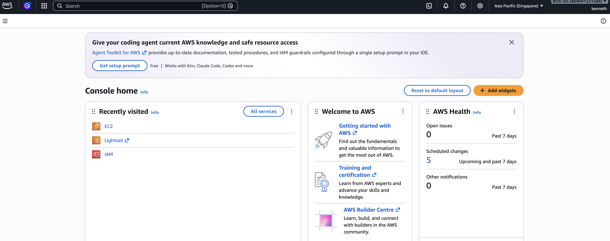

### Step 2 — Search for Lightsail

In the search bar at the top, type **"lightsail"** and select **Lightsail** (Launch and Manage Virtual Private Servers).

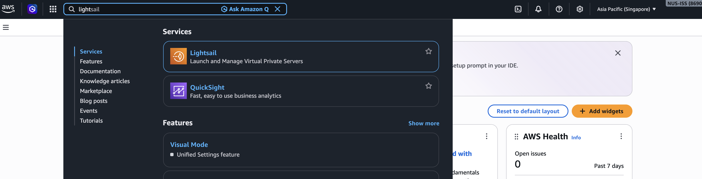

### Step 3 — Create Instance

On the Lightsail home page, click **Create instance**.

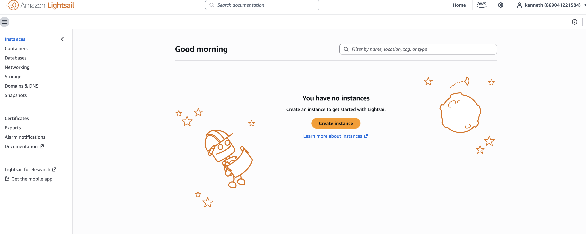

### Step 4 — Choose Instance Image

Configure the following:

| Setting | Value |
|---|---|
| **Instance location** | Singapore, Zone A (`ap-southeast-1a`) |
| **Platform** | Linux operating system |
| **Blueprint** | Ubuntu 24.04 LTS |

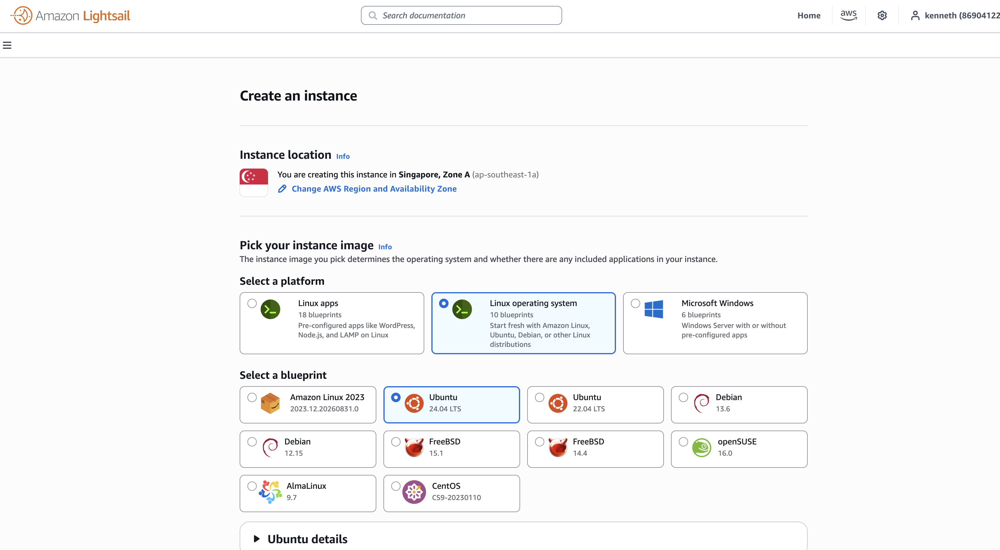

### Step 5 — Choose Instance Plan

Configure the following:

| Setting | Value |
|---|---|
| **Plan type** | General purpose |
| **Network type** | Dual-stack (Recommended) — includes public IPv4 + IPv6 |
| **Size** | **$24 USD/month** — 4 GB Memory, 2 vCPUs, 80 GB SSD, 4 TB Transfer |

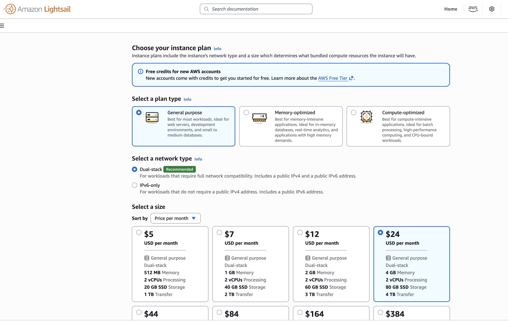

### Step 6 — Configure & Launch

| Setting | Value |
|---|---|
| **Instance name** | `MyAgent-kenneth` |
| **Automatic snapshots** | Disabled (optional) |
| **Tags** | None |

Click **Create instance**.

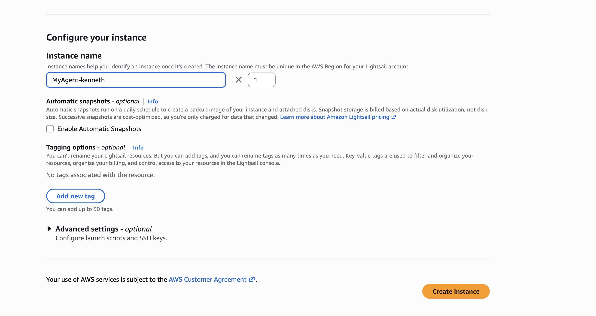

### Step 7 — Instance Details

Once created, the instance will show:

| Property | Value |
|---|---|
| **Name** | MyAgent-kenneth |
| **OS** | Ubuntu 24.04 LTS |
| **Region** | Singapore, Zone A (`ap-southeast-1a`) |
| **Specs** | 4 GB RAM, 2 vCPUs, 80 GB SSD |
| **Instance type** | General purpose |
| **Networking** | Dual-stack |
| **Public IPv4** | `18.xxx.xxx.xxx` |
| **Private IPv4** | `172.xxx.xxx.xxx` |
| **SSH username** | `ubuntu` |

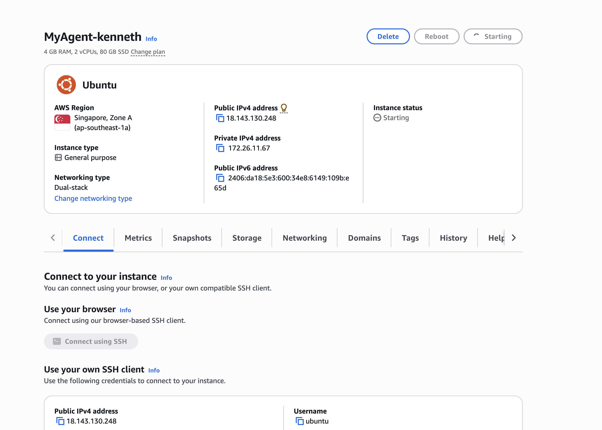

### Step 8 — Connect via SSH

You can connect using the **browser-based SSH client** (click **Connect using SSH**) or use your own terminal:

```bash
ssh ubuntu@18.xxx.xxx.xxx
```

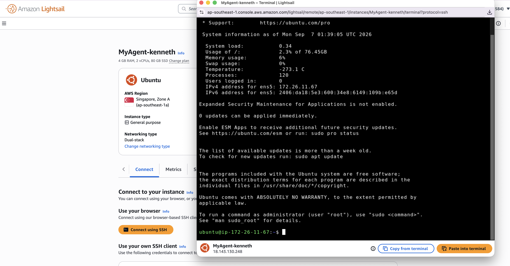

---

# Install and Configure OpenClaw

Step-by-step guide to install [OpenClaw](https://openclaw.ai) — an AI agent that manages the box — on the Lightsail instance, and connect it to a self-hosted, Ollama-compatible gateway backed by AWS Bedrock (the same gateway set up in the LLM Gateway section below).

### Step 1 — Connect to the instance

Open the Lightsail instance and click **Connect using SSH** (or use your own SSH client, as in the provisioning guide above).

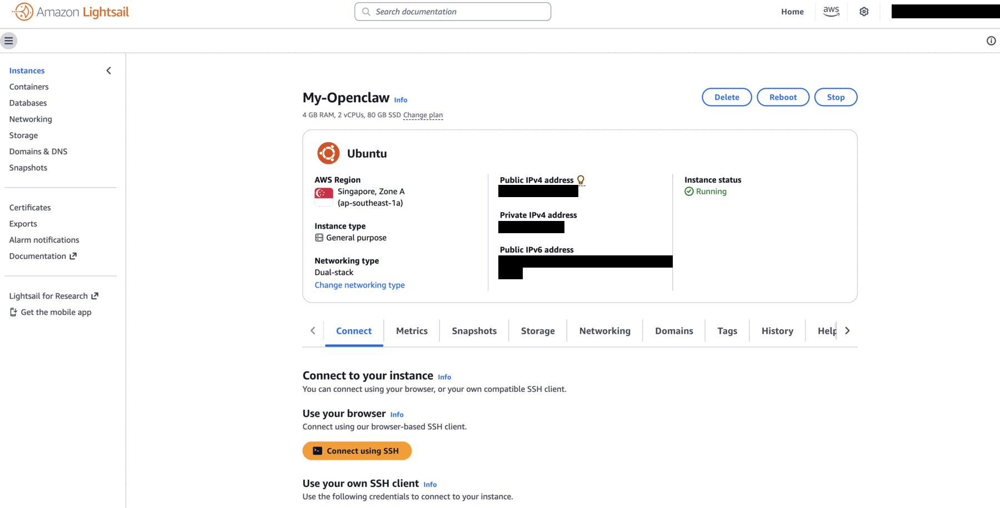

### Step 2 — Install the OpenCode CLI

OpenCode is used later to drive OpenClaw's configuration conversationally.

```bash
curl -fsSL https://opencode.ai/install | bash
source ~/.bashrc
```

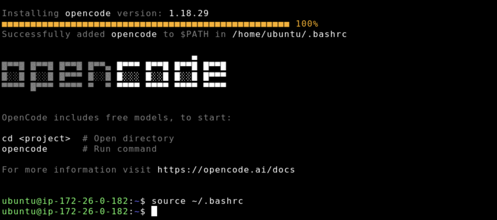

### Step 3 — Install Node.js via nvm

OpenClaw ships as an npm package, so install `nvm` and Node 24 first.

```bash
curl -o- https://raw.githubusercontent.com/nvm-sh/nvm/v0.40.7/install.sh | bash
\. "$HOME/.nvm/nvm.sh"
nvm install 24
```

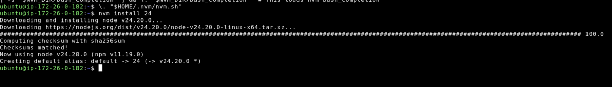

### Step 4 — Verify Node.js and npm

```bash
node -v   # v24.20.0
npm -v    # 11.19.0
```

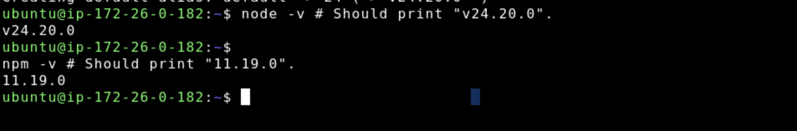

### Step 5 — Install OpenClaw

```bash
curl -fsSL https://openclaw.ai/install.sh | bash
```

The installer detects Node.js, installs the `openclaw` npm package, and links the `openclaw` binary into the active nvm Node version.

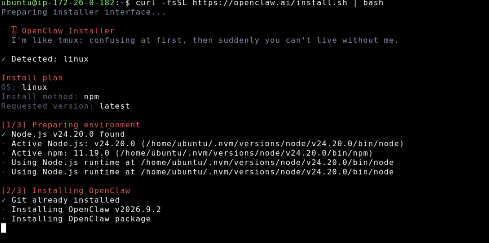

### Step 6 — Run the onboarding wizard

Installation drops straight into the onboarding wizard (re-run it any time with `openclaw onboard`). Read the security disclaimer — **OpenClaw runs an AI agent with real access to the machine** (see the [security guide](https://docs.openclaw.ai/gateway/security)) — then choose **Quick start**.

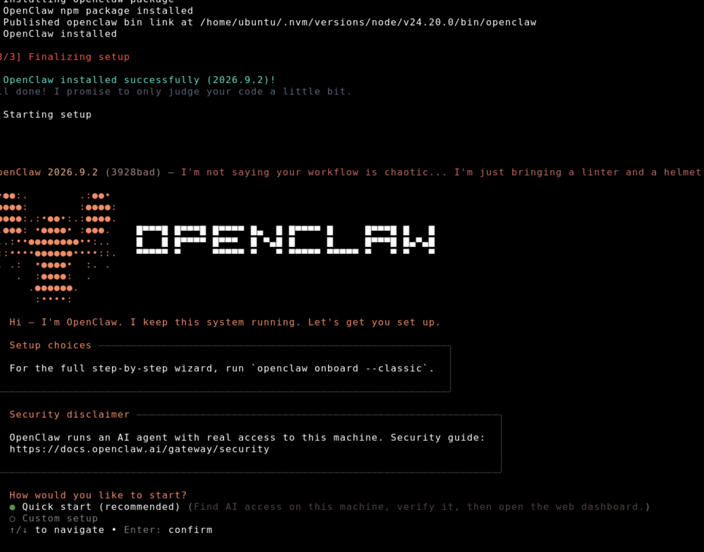

### Step 7 — Review AI detection results

Quick start scans the box for usable AI access. On a fresh instance nothing is found yet, so it falls back to manual provider setup and prints the next steps:

| Item | Value |
|---|---|
| Workspace | `/home/ubuntu/.openclaw/workspace` |
| Add AI later | `openclaw onboard` |
| Add a channel | `openclaw channels add` |
| Open dashboard | `openclaw dashboard` |

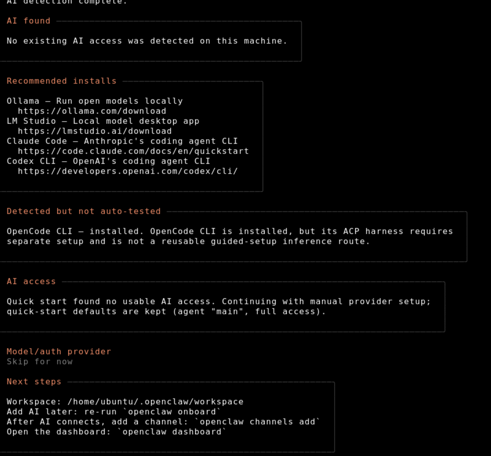

### Step 8 — Verify the installed files

```bash
ls -al ~
cd ~/.openclaw && ls
```

`~/.openclaw` holds `openclaw.json` (the live config), `openclaw.json.bak`, and the agent `state`.

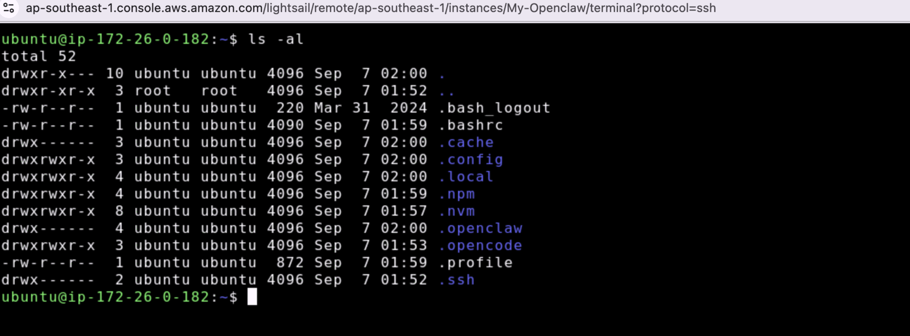

### Step 9 — Launch OpenCode against the OpenClaw config

From inside `~/.openclaw`, run OpenCode in unattended mode so it can edit the config directly:

```bash
opencode --yolo
```

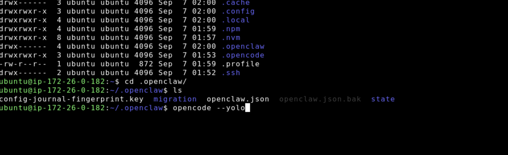

### Step 10 — Configure OpenClaw for a self-hosted Bedrock-proxy gateway

At the OpenCode prompt, describe the gateway and hand over its URL, API key, and model ID (use your own AWS LLM Gateway values):

```
Configure openclaw using a self-hosted Ollama server that will proxy to AWS Bedrock.
This is the url and api key
LLM_GATEWAY_URL=http://<your-alb-dns-name>
LLM_GATEWAY_API_KEY=<your-api-key>
LLM_MODEL=global.anthropic.claude-sonnet-4-5-20250929-v1:0
```

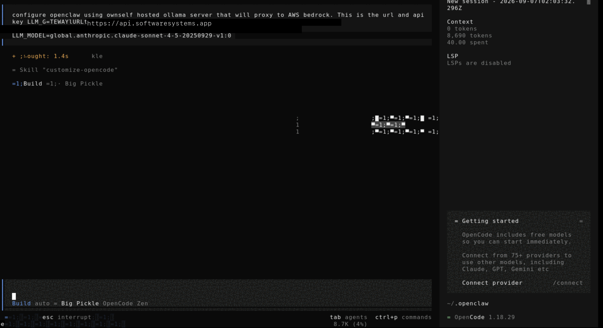

OpenCode edits `~/.openclaw/openclaw.json` and adds a new provider (note the provider type is `"api": "ollama"`, not `"openai"`):

```json
{
  "models": {
    "providers": {
      "ollama": {
        "baseUrl": "https://<your-custom-domain>",
        "apiKey": "<your-api-key>",
        "api": "ollama",
        "headers": {
          "Authorization": "Bearer <your-api-key>"
        },
        "models": [
          {
            "id": "sonnet4.5:latest",
            "name": "Claude Sonnet 4.5"
          }
        ]
      }
    }
  }
}
```

Restart OpenClaw after saving for the change to take effect.

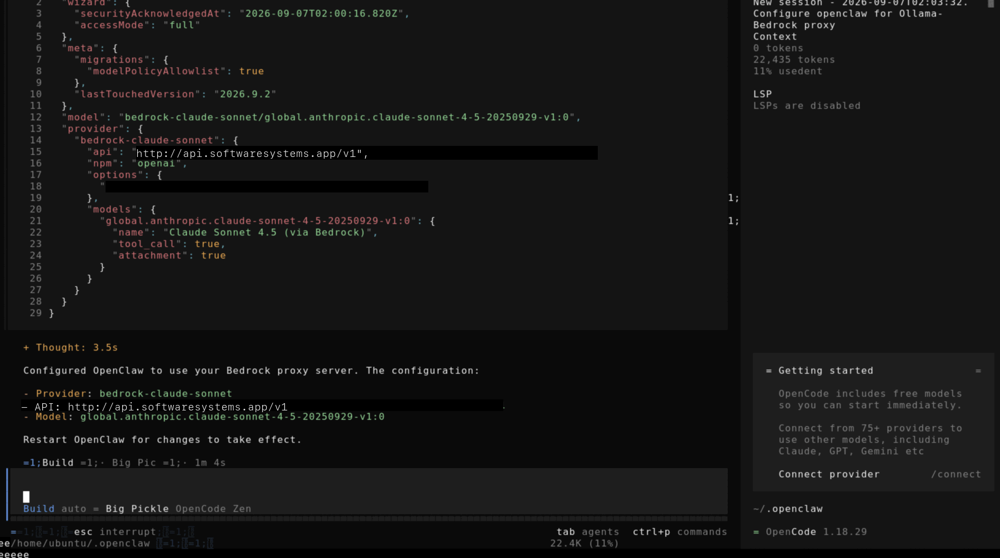

### Step 11 — Known issue: AWS WAF blocks large request bodies

A real agent turn (system prompt + tool schemas) can exceed the default AWS WAF body-inspection limit on the ALB (~8 KiB), returning `403 Forbidden` even though small test chats succeed. Fix it by raising or removing the oversize-body rule on the ALB's WAF (set oversize handling to **CONTINUE** instead of blocking) — no OpenClaw-side config change is needed.

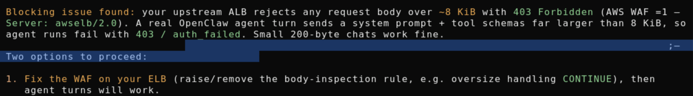

### Step 12 — Restart the OpenClaw gateway

```bash
ps aux | grep -i openclaw
sudo systemctl restart openclaw-gateway
sudo systemctl status openclaw-gateway
```

Once restarted, the gateway runs as the `openclaw-gateway.service` systemd unit, listening on `127.0.0.1:18789`, and reloads `openclaw.json` automatically. Verify with:

```bash
openclaw agent --model ollama/sonnet4.5:latest -m "hello"
```

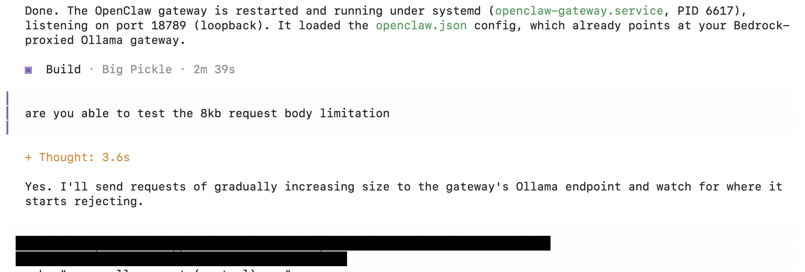

### Step 13 — Tune the context window and token budget

The model's 200K-token context is a hard ceiling. To keep agent turns comfortably under both that limit and the WAF body-size limit:

1. Leave `compaction.enabled: true` so old turns get summarized automatically.
2. Keep `contextWindow: 200000` accurate; lower `maxTokens` (e.g. from 8192 to 4096) to free up more room for input per request.
3. Point agents at files in the workspace instead of pasting large documents into prompts.
4. Trim skill/system prompt content — every instruction token counts against the same budget.

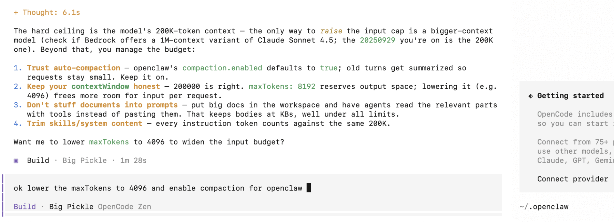

---

# LLM Gateway — Travel Cost Estimation Agent

A LangChain/LangGraph test script that connects to an **AWS-hosted LLM Gateway** (Ollama-compatible API fronting Claude Sonnet 4.5) and demonstrates **tool calling** with a travel cost estimation agent.

This project is used to **test the AWS API key provided LLM Gateway** — verifying connectivity, authentication via `X-API-Key` header, and end-to-end tool-calling behavior through the AWS LLM Gateway endpoint.

## What it does

1. Connects to the **AWS LLM Gateway** via `ChatOllama` (Ollama-compatible `/api/chat` endpoint)
2. Authenticates using the provided **AWS API key** (sent as `X-API-Key` header)
3. Sends a user query: *"Plan a 2-day Tokyo trip for 2 adults. Mid comfort. how much will be the cost"*
4. The model emits a JSON tool request (the gateway has no native tool-call support, so a JSON protocol is used)
5. The script parses the JSON, **actually invokes** the `estimate_trip_cost` tool, and feeds the result back
6. The model presents the final answer driven by the real tool output
7. Prints the auto-generated OpenAI-compatible tool schema

### Example output

```
>>> Tool request: {'tool': 'estimate_trip_cost', 'args': {'destination': 'Tokyo', 'days': 2, 'travelers': 2, 'comfort': 'mid'}}
>>> Tool result: {'destination': 'Tokyo', ..., 'total_estimate': 1210, ...}

# 2-Day Tokyo Trip Cost Estimate for 2 Adults (Mid Comfort)
## Total Estimated Cost: SGD $1,210
...
```

## Setup

### 1. Create a virtual environment and install dependencies

```bash
python3 -m venv .venv
.venv/bin/pip install langgraph langchain-openai python-dotenv langchain_ollama ipython
```

### 2. Create a `.env` file

Copy the template below into a file named `.env` in the project root. Replace the placeholder values with the **AWS-provided** credentials:

```env
# AWS LLM Gateway configuration
LLM_GATEWAY_URL=https://api.softwaresystems.app
LLM_GATEWAY_API_KEY=your-aws-provided-api-key-here
LLM_MODEL=global.anthropic.claude-sonnet-4-5-20250929-v1:0
```

| Variable | Description |
|---|---|
| `LLM_GATEWAY_URL` | Endpoint URL of the AWS LLM Gateway (Ollama-compatible) |
| `LLM_GATEWAY_API_KEY` | AWS-provided API key, sent as `X-API-Key` header for authentication |
| `LLM_MODEL` | Model identifier available on the gateway |

> **Note:** All three variables are **required** — the script will raise an error if any are missing.

### 3. Run

```bash
.venv/bin/python test_llm_gateway.py
```

There is also a **LangGraph-driven version**, `test_llm_gateway_langgraph.py`, which runs the exact same request/tool/respond cycle through an actual compiled `StateGraph` (`graph.invoke(...)`) instead of a plain Python `while` loop:

```bash
.venv/bin/python test_llm_gateway_langgraph.py
```

It uses the same `.env`, the same `estimate_trip_cost` tool, and the same system/tool-call prompts — only the control flow differs (see [How tool calling works here](#how-tool-calling-works-here)).

## Project structure

```
.
├── test_llm_gateway.py            # Manual while-loop version — agent loop + tool calling
├── test_llm_gateway_langgraph.py  # Same agent, driven by a compiled LangGraph StateGraph
├── .env                           # Gateway URL, API key, model (not committed)
└── .venv/                         # Python virtual environment
```

## How tool calling works here

The gateway does **not** implement Ollama's native tool-calling protocol (the `tools` field in `/api/chat` is silently ignored). To work around this, the model is instructed to reply with only a JSON tool request when a cost estimate is needed:

```json
{"tool": "estimate_trip_cost", "args": {"destination": "Tokyo", "days": 2, "travelers": 2, "comfort": "mid"}}
```

**`test_llm_gateway.py`** handles this with a manual loop:

1. **`extract_tool_call()`** parses the JSON from the model's text response
2. **`run_agent()`** executes the tool via `estimate_trip_cost.invoke(args)` and feeds the result back to the model in a `while`-style loop (max 4 iterations)
3. The model then presents the final answer using the **real** tool data

A `StateGraph` + `ToolNode` setup is also present in this file (lines 140–191) but is dead code kept for reference — LangGraph's built-in `tools_condition`/`ToolNode` key off `message.tool_calls`, which this gateway never populates, so it can't drive the actual run.

**`test_llm_gateway_langgraph.py`** solves that by building a real, working graph around the same JSON-parsing logic instead of the prebuilt tool nodes:

- `chatbot` node — invokes the model with retry, same as `invoke_with_retry()`
- `route_after_chatbot` — a conditional edge that calls `extract_tool_call()` on the latest message text and routes to `"tools"` when a request is found, or `END` otherwise
- `tools` node (`call_tool`) — parses the JSON, invokes `estimate_trip_cost`, and appends the result as the next user message
- `tools → chatbot` edge closes the loop; `graph.invoke()` runs it end to end, bounded by `recursion_limit` (raises `GraphRecursionError`, caught and reported as "Max tool-call iterations reached")

## The `estimate_trip_cost` tool

A heuristic trip budget estimator (SGD). Per-person-per-day rates:

| Category | Budget | Mid | Premium |
|---|---|---|---|
| Lodging | 60 | 140 | 300 |
| Food | 30 | 60 | 120 |
| Local transport | 10 | 20 | 50 |
| Activities | 20 | 50 | 120 |

Plus a 12% contingency buffer. Excludes international flights, insurance, and visa fees.

## Known issues & notes

- **AWS LLM Gateway rate limiting:** The gateway may return `403 Forbidden` on rapid successive requests. The script includes `invoke_with_retry()` with linear backoff (3s, 6s, 9s…) to handle this.
- **Duplicate `SYSTEM` prompt:** The first `SYSTEM` definition (lines 42–53) is dead code — the second definition (lines 55–68) overwrites it. Kept for reference from the original Colab notebook.
- **Graph diagram:** `draw_mermaid_png()` renders as an IPython `Image` object — visible in Jupyter/Colab but not in terminal output.
